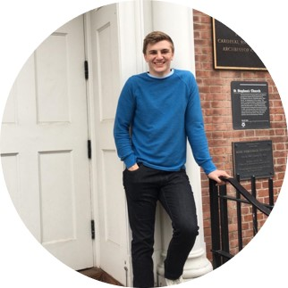

:::: {.columns}
::: {.column width="30%"}
 
{width=85%}

:::
::: {.column width="70%"}

### Cason Wight  
Cason Wight is a data scientist, finishing a Master's in Statistics from BYU. He loves skiing, white-water rafting, tennis, and referring to himself in the third person. He grew up in Oregon and has always felt a pull to the Pacific Northwest.

He is passionate about data visualization and is interested in the trade-off between the accuracy of machine learning and the inference of statistical modeling. He is skilled in `R`, `python`, and several statistical methods. He is currently studying deep learning methodology, app development, and big data tools. 

**Ask him about**  
•  Star Wars  
•  Wrestling  
•  Chess  
•  Basic Philosophy  

**Don't ask him about**  
•  Pokémon  
•  Football  
•  The purpose of the numlock key  

:::
::::

<link rel="stylesheet" href="https://cdnjs.cloudflare.com/ajax/libs/font-awesome/4.7.0/css/font-awesome.min.css">
  

    
    
    

<a href="Resume 2020.pdf" download>
Download my Resume
</a>

Made by Cason Wight
