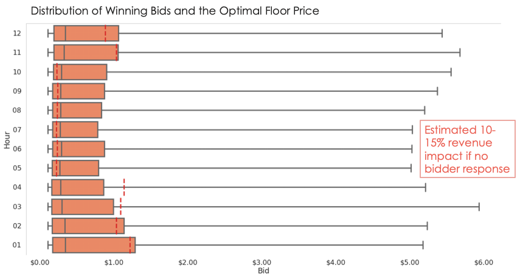
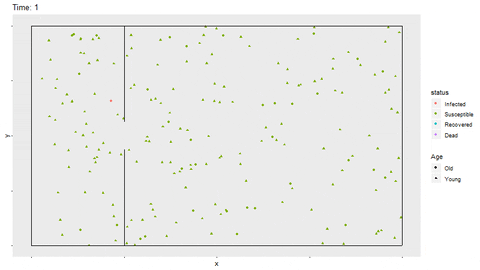
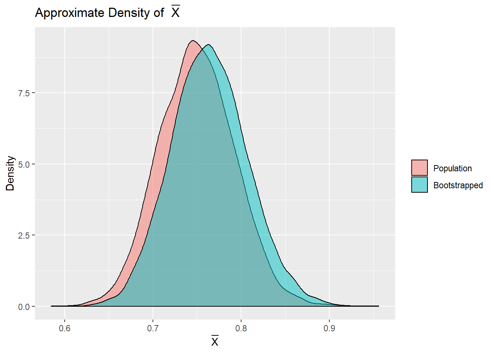

:::: {.col-md-12}
::: {.col-md-5}
{width=95%}
:::
::: {.col-md-7}
 
 
<a href = "https://medium.com/xandr-tech/floor-price-for-first-price-auctions-e6e66c966451">
Floor Price Algorithm in Ad Auctions
</a>
**Medium**  
*Oct 23, 2020* 
:::
::::

:::: {.col-md-12}
::: {.col-md-5}
{width=95%}
:::
::: {.col-md-7}
 
 
<a href = "https://statexchange.netlify.app/2020/04/02/infection-spread/">
Simulating Infection Spread
</a>
**Statexchange** (personal blog, in progress)  
*Apr 2, 2020* 
:::
::::

:::: {.col-md-12}
::: {.col-md-5}
{width=95%}
:::
::: {.col-md-7}
 
 
<a href = "https://statexchange.netlify.app/2020/03/05/bootstrapping/">
Bootstrapping
</a>
**Statexchange** (personal blog, in progress)  
*Mar 5, 2020* 
:::
::::

<link rel="stylesheet" href="https://cdnjs.cloudflare.com/ajax/libs/font-awesome/4.7.0/css/font-awesome.min.css">
  

    
    
    

<a href="Resume 2020.pdf" download>
Download my Resume
</a>

Made by Cason Wight
