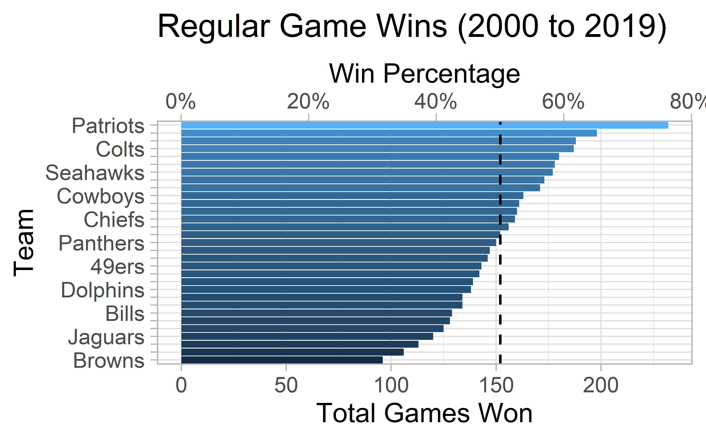
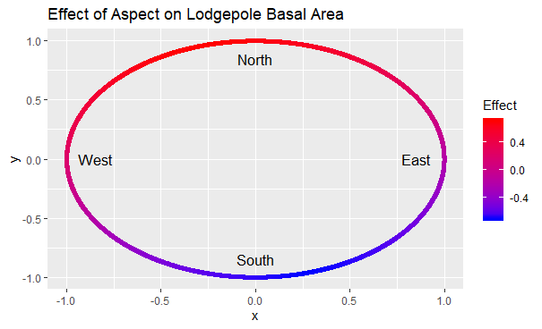
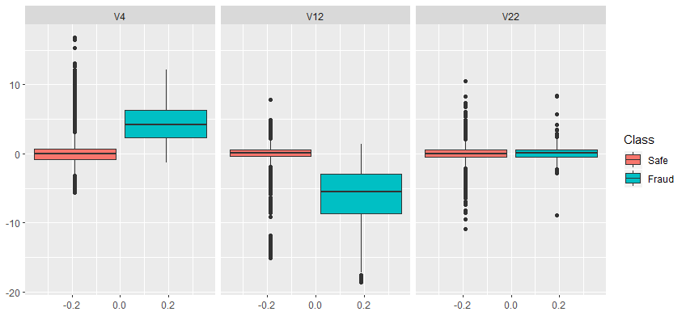

  
:::: {.col-md-12}
::: {.col-md-5 style="height:200px"}

<a href="Stat 651 Project/Project Report.pdf" download  target="_blank">{width=95%}</a>

:::
::: {.col-md-7 style="height:200px"}

<a href="Stat 651 Project/Project Report.pdf" download target="_blank">
Impact of Covid on NFL Attendance (Bayesian Time Series)
</a>

**Code:** <a href="Stat 651 Project/Analysis Code.Rmd" download target="_blank">Analysis (.Rmd)</a> | <a href="Stat 651 Project/final_stan.stan" download>Model (.stan)</a>

<a href="Stat 651 Project/Project Presentation.pdf" download>
Slides
</a>
*Dec 5, 2020*

:::
::::

:::: {.col-md-12}
::: {.col-md-5 style="height:200px"}

<a href="Stat 666 Project/Project Report.pdf" download>{width=95%}</a>

:::
::: {.col-md-7 style="height:200px"}

<a href="Stat 666 Project/Project Report.pdf" download>
Predicting BYU Speech Authorship (Natural Language Processing)
</a>

**Code:** <a href="Stat 666 Project/clean_analysis.py" download>Analysis (.py)</a> | <a href="Stat 666 Project/EDA.py" download>Exploratory Data Analysis (.py)</a>

<a href="Stat 666 Project/Final Project.pptx" download>
Slides
</a>
*Dec 4, 2020*

:::
::::

:::: {.col-md-12}
::: {.col-md-5 style="height:200px"}

<a href="Stat 536 Lodgepole Project/Project Report.pdf" download>{width=95%}</a>

:::
::: {.col-md-7 style="height:200px"}

<a href="Stat 536 Lodgepole Project/Project Report.pdf" download>
Lodgepole Pine Growth in the High Uintas (Nonlinear Regression with Spatial Correlation)
</a>

**Code:** <a href="Stat 536 Lodgepole Project/forest.r" download>Analysis (.R)</a>

**Other Resources:** <a href="Stat 536 Lodgepole Project/LodgepoleInUintas.csv" download>Data (.csv)</a> | <a href="Stat 536 Lodgepole Project/predictgls.R" download>Predict GLS Function (.R)</a> | <a href="Stat 536 Lodgepole Project/stdres.gls.R" download>Standardized Residuals GLS Function (.R)</a>

*Mar 11, 2020*

:::
::::

:::: {.col-md-12}
::: {.col-md-5 style="height:200px"}

<a href="Stat 536 Credit Project/Project Report.pdf" download>{width=95%}</a>

:::
::: {.col-md-7 style="height:200px"}

<a href="Stat 536 Credit Project/Project Report.pdf" download>
Credit Card Fraud Detection (Various ML Methods)
</a>

**Code:** <a href="Stat 536 Credit Project/CreditFraud.py" download>Analysis (.py)</a> | <a href="Stat 536 Credit Project/Boxplots.R" download>Exploratory Data Analysis (.R)</a>

**Other Resources:** <a href="https://www.kaggle.com/mlg-ulb/creditcardfraud/home" download>Data (.csv)</a> | <a href="Stat 536 Credit Project/probs_knn.csv" download>KNN Predicted Probabilities (.csv)</a> | <a href="Stat 536 Credit Project/pred_probs.csv" download>Classification Tree Predicted Probabilities (.csv)</a>

<a href="Stat 536 Credit Project/Project Report.pdf" download>
Slides
</a>
*Apr 8, 2020*

:::
::::

:::: {.col-md-12}
::: {.col-md-5 style="height:200px"}

<a href="Stat 535 Project/Project Report.pdf" download>{width=95%}</a>

:::
::: {.col-md-7 style="height:200px"}

<a href="Stat 535 Project/Project Report.pdf" download>
Examples of Linear Modeling
</a>

**Code:** <a href="Stat 666 Project/Application Portfolio.Rmd" download>Analysis (.Rmd)</a>

**Other Resources:** <a href="Stat 535 Project/fires.csv" download>Fire Data (.csv)</a> | <a href="Stat 535 Project/HotChocolate.csv" download>Hot Chocolate Data (.csv)</a> | <a href="Stat 535 Project/grades.csv" download>Grades Data (.csv)</a> | <a href="Stat 535 Project/MyTemplate.docx" download>Word Template (.docx)</a>

*Nov 15, 2019*

:::
::::

<link rel="stylesheet" href="https://cdnjs.cloudflare.com/ajax/libs/font-awesome/4.7.0/css/font-awesome.min.css">
  

    
    
    

<a href="Resume 2020.pdf" download>
Download my Resume
</a>

Made by Cason Wight
